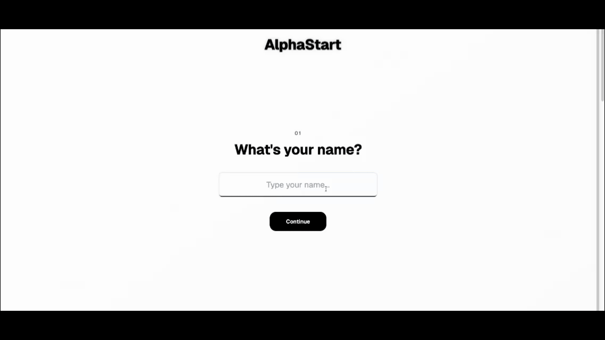

# Alpha Start

## Overview

Alpha Start is a platform that helps you find the best stocks to invest in.

### Demo

# Table of Contents

- [Features](#features)
- [Technologies Used](#technologies-used)
- [System Design](#system-design)
- [How the agent works](#how-the-agent-works)

## Features
- Risk Management Feature that claude uses to manage risk
- Stock screener that uses claude to screen stocks
- Stock research that uses claude to research stocks
- Stock news that uses claude to summarize news

## Technologies Used

  <h3>🚀 Frontend</h3>
  
  
  
  
  
  <h3>🧠 Backend & AI</h3>
  
  
  
  
  
  
  <h3>🎨 Design</h3>
  
  
  

## System Design

How the agent works:

# Features we are working on
- Showing P/E ratio, EPS, Market Cap
- Adding more metrics to the stock screener
- Summarizing news with agent